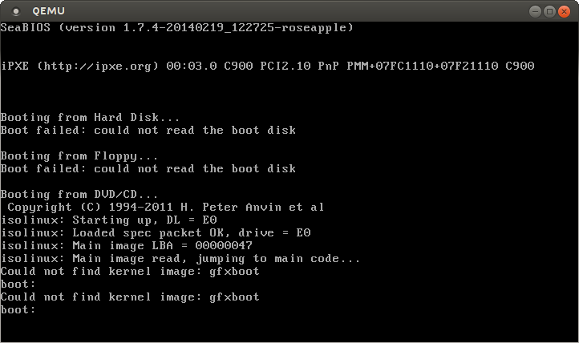
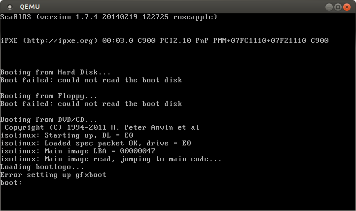
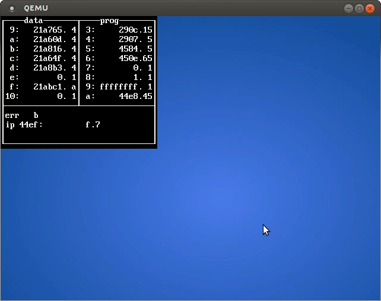
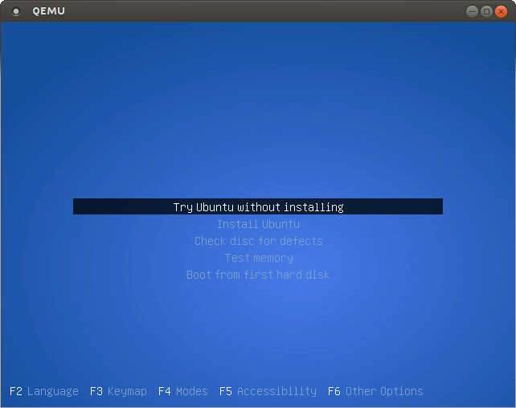

syslinux-themes-ubuntu-mate
===========================
All the steps documented 'cos we gonna redo some for live-image-mate-desktop.

Destination paths are relative 'cos I'm standing in the isolinux directory.

``` bash
cp /usr/lib/syslinux/isolinux-debug.bin isolinux.bin
#or
cp /usr/lib/syslinux/isolinux.bin isolinux.bin #for production
```


***


``` bash
cp /usr/share/syslinux/themes/ubuntu-trusty/isolinux-live/isolinux.cfg .
```


***


``` bash
cp /usr/lib/syslinux/gfxboot.c32 .
```


***


``` bash
cp /usr/share/syslinux/themes/ubuntu-trusty/isolinux-live/menu.cfg .
```


***


``` bash
tar -xf /tmp/gfxboot-theme-ubuntu/install/bootlogo.tar.gz
```
* This should come from `gfxboot-theme-ubuntu: /usr/share/gfxboot-theme-ubuntu/bootlogo.tar.gz` but at the moment there is some bugchaseing and I built it from source.
* Note that cpio archive `bootlogo` contins only one file `init`. With the help of isolinux bootloader we have access to a filesystem, however for other usages, some files that reside in our isolinux directory might need to be added also inside the `booglogo` cpio archive.


***

So it works... Ok then lets check on dependancyes.

`isolinux.cfg`:
* `default vesamenu.c32`
``` bash
cp /usr/lib/syslinux/vesamenu.c32 .
```

In `menu.cfg` we asked for:
* stdmenu.cfg
``` bash
cp /usr/share/syslinux/themes/ubuntu-trusty/isolinux-live/stdmenu.cfg .
```
* txt.cfg
``` bash
cp /usr/share/syslinux/themes/ubuntu-trusty/isolinux-live/txt.cfg .
```
* gtk.cfg
``` bash
# Can't find it anywhere / don't have a clue reagarding its purpose
```
* adtxt.cfg
``` bash
cp /usr/share/syslinux/themes/ubuntu-trusty/isolinux-live/adtxt.cfg .
```
* adgtk.cfg
``` bash
# Can't find it anywhere / don't have a clue reagarding its purpose
```
* prompt.cfg
``` bash
cp /usr/share/syslinux/themes/ubuntu-trusty/isolinux-live/prompt.cfg .
```

***

stdmenu.cfg:
* splash.png
``` bash
wget https://raw.githubusercontent.com/nadrimajstor/syslinux-themes-ubuntu-mate/master/ubuntu-mate-syslinux-splash.png -O splash.png
```

txt.cfg
* /casper/vmlinuz `do not go to isolinux directory - ignoring for now`
* /cdrom/preseed/ubuntu.seed `do not go to isolinux directory - ignoring for now`
* /casper/initrd.lz `do not go to isolinux directory - ignoring for now`
* /install/mt86plus `do not go to isolinux directory - ignoring for now`
* localboot 0x80
``` bash
cp /usr/lib/syslinux/chain.c32 .
```
